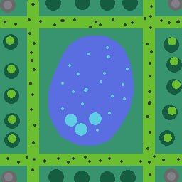

# robot-repair-Oliferuk
## Щоденник розробника
### 18.09.2026 — Лаба 2 

Створив сцену, додав персонажа, намалював все тайлмапом і зробив простенький біг. 

Нічого складного наче так не було.
З розділу **More things to try** зробив два пункти:
1. Керування через джойстик.
2. Намалював піксельну сцену в Aseprite.

